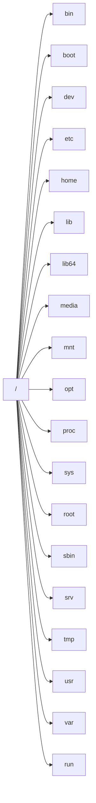

UNIX-based operating systems uses one big file system tree, started with the root (*/*) directory.
This filesystem can contain many distinct filesystems, mounted at various points, which appear as subdirectories.

## Data distinctions

### Shareable vs non-shareable

- `shareable`: can be shared between different hosts, eg.: user home directory
- `non-shareable`: specific to a particular host, eg.: device lock files

### variable vs static

- `variable`: may change without sysadmins help, eg.: process files
- `static`: does not change without admin, eg.: binaries, libraries

## Filesystem Hierarchy Standard (FHS)

- maintained by Linux Foundation
- specifies the main directories that need to be present and describe their purposes
- simplifies predictions of file locations
- additional directories not violates the standard
- components in directories other than the standard describe is violate FHS
- [documentation][1]

### `/`

- primary directory of the filesystem
- must contain all essential files required to boot and mount other filesystems
- according to FHS, no application should create a new subdirectory of the root
- only `root` user can write to this directory 

### `/bin`

- /**bin**ary
- contains all essential command binaries that needed for all user
- must contain all tools that needed in **singel user mode** or in **recovery mode**
- non-essential commands are placed in `/usr/bin` instead of `/bin`, like commands required only by non-root users
- recent distros do not separate `/bin/` and /`usr/bin`, instead uses a symbolic link to `/usr/bin`

### `/boot`

- contains static files needed to boot the system
- often a separate partition
- contains: kernel, initramfs images, boot configuration files and bootloader
- `vmlinuz`: compressed Linux kernel
- `initramfs`/`initrd`: initial RAM filesystem / initial RAM disk, mounted before the real root filesystem become available
- `config`: kernel compilation parameters
- `System.map`: kernel symbol table, used for debugging 
- on EFI systems this is the `EFI System Partition`

### `/dev`

- /**dev**ices
- contains special device files (device nodes)
- **pseudo-filesystem**
- old systems uses `devfs`, moderns uses `udev` as its filesystem
- files represents devices in your system
- contains character devices (byte-stream, eg.: `/dev/hwrng`) and block devices (eg.: `/dev/sda`)
- used to interact with hardwares and softwares
- on modern distros, `udev` is responsible for dynamically modifying files in `/dev` if devices are found (at boot time or on the fly) or removed
- network interfaces are too [complex][2] to be placed in `/dev`
- `/dev` is empty when the computer powered off

### `/etc`

- [/**etc**etera][3]
- host specific system-wide configuration files
- applications may pre-populate this directory with its vendor-supplied configuartion files  
- `/etc/resolv.conf`: the system's DNS server
- `/etc/passwd`: user database
- `/etc/shadow`: users encrypted passwords
- `/etc/group`: list of groups and its users
- `/etc/skel`: template for new users
- `/etc/init.d`: contains daemon scripts for SysV

### `/home`

- users home directories
- regular users probably use this for its home directory, eg.: `/home/g0rbe` for user `g0rbe`
- here is stored the user specific configurations, files and scripts
- shorthands to get logged in user's home directory: `~` and `$HOME`

### `/lib`

- /**lib**rary
- contains essential shared libraries and kernel modules
- these libraries is needed to execute binaries in `/bin` and `/sbin`
- kernel modules and drivers stored in `/lib/modules/`
- PAM modules stored in `/lib/security/` 
- recent distros uses symlink to `/usr/lib`

### `/lib64`

- essential libraries for 64bit system executables
- used when both 32 and 64 bit executables supported by the system 

### `/media`

- mount point for removable media
- when automatic mount is enabled, `udev` creates a folder and mount the filesystem there 

### `/mnt`

- /**m**ou**nt**
- mount point for temporary filesystems

### `/opt`

- /**opt**ional
- optional application packages that not part of the system distribution, but from an independent source 
- used by packages to keep all of their files in one isolated folder instead of placing files to their proper place, eg.: configs in `/etc`, binaries in `/bin`, etc...

### `/proc`

- /**proc**ess
- virtual **pseudo-filesystem** called `procfs`
- used to give information about the system and the processes 
- files anf folders in `/proc` are resides only in the memory
- every process have a subdirectory named as the process's PID and contains information about the process, eg.: PID, name, parent process, resources used, etc...
- most of the file's size is 0 while containing data
- like `/dev`, the `/proc` is empty on a non-running system
- `/proc/sys` is used to get and alter system configurations

### `/sys`

- /**sys**tem
- virtual **pseudo-filesystem** called `sysfs`
- used to give information about the system (devices, drivers, kernel modules, system configuration structures, etc...) and to alter system settings
- files and folders in `/sys` are resides only in the memory
- like `/dev` and `/proc`, the `/sys` is also empty when computer turned off
- strict standards about what can contain
- most files are contains only one line or value

### `/root`

- home directory of the `root` user
- `root` specific configurations, files and executables
- located outside of /home in order to make sure the root user may log in even without /home being available

### `/sbin`

- /**s**ystem **bin**ary
- essential system binaries for booting, restoring, recovering and/or repairing the system and mounting other filesystems
- recent distros uses symlink to `/usr/sbin`

### `/srv`

- /**s**e**rv**ice
- data for services provided by this system
- rarely used

### `/tmp`

- /**t**e**mp**orary
- used to store temporary files (eg.: lock files)
- probably a ramdisk in memory called `tmpfs`
- probably flushed across a reboot
- can be accessed by anyone, the permissions are `0777`
- should not used to store large files

### `/usr`

- /**us**e**r** or todays: /**U**ser **S**ystem **R**esources
- multi-user (*user-land*) applications, utilities and datas stored here are not needed to boot the system
- contains a secondary hierarchy (`/usr/bin`, `/usr/lib`, etc...)
- typically a read-only directory
- `/usr/share/man`: man pages stored here
- `/usr/lib`: C and C++ API header file of system libraries

### `/var`

- /**var**iable
- variable datas that changes during system operations
- must be writeable
- stored here:
    - log files (`/var/log`)
    - spool file for further processing (`/var/spool`)
    - administrative data files
    - transient and temporary files, like cache (`/var/cache`)
    - user's mailbox (`/var/mail`)
    - root for websites (`/var/www`)

### `/run`

- /**run**time
- used to store runtime data
- required by `udev`
- a pseudo-filesystem stored in memory, called `tmpfs`

[1]: https://refspecs.linuxfoundation.org/FHS_3.0/fhs-3.0.pdf
[2]: https://unix.stackexchange.com/questions/23199/why-are-network-interfaces-not-in-dev-like-other-devices
[3]: https://ask.slashdot.org/story/07/03/03/028258/define---etc
