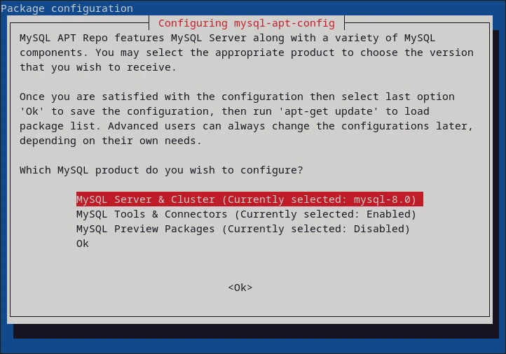


MySQL was replaced by [Mariadb](../../mariadb/setup/) in Debian 9 (Stretch).


## Repository Setup

Download and install the Repository Setup Package:

https://dev.mysql.com/downloads/repo/apt/


Download the `deb` package for Debian based distros:

```bash
wget https://dev.mysql.com/get/mysql-apt-config_0.8.33-1_all.deb
```

```bash
dpkg -i mysql-apt-config_0.8.33-1_all.deb
```

## Configure Repository



## Install


```bash
apt update
```

```bash
apt install mysql-community-server
```